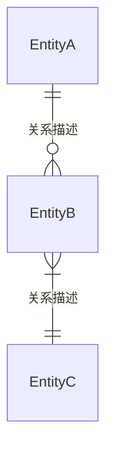
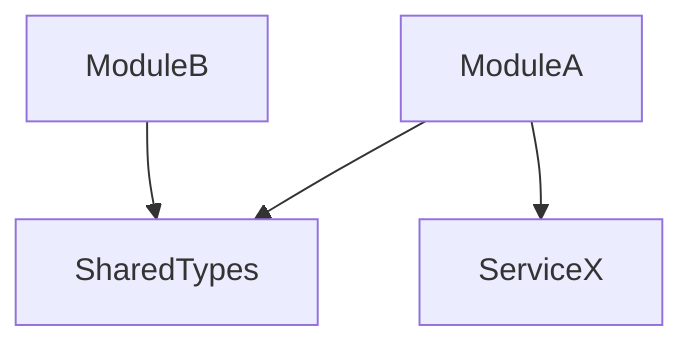

<!-- AI-INSTRUCTIONS
⚠️ 业务代码映射维度（按需层）。

核心价值: 快速定位"某个业务概念"在代码中的所有相关文件，避免遗漏修改点。
使用方式: 拿到需求后，先在映射表中查找涉及的业务概念，获取所有相关文件列表。
关键规则: 修改某个业务功能时，必须检查映射表中列出的所有相关文件，评估影响范围。
加载时机: 修改已有功能、定位代码、评估变更影响时加载。
-->

# 维度: 业务代码映射

最后更新: {ISO 8601}

---

## 1. 业务概念→代码映射

<!-- PRIORITY: HIGH — 核心导航表 -->

### {业务概念/模块名}

| 层级 | 文件 | 职责 |
|------|------|------|
| 页面 | `{path}` | {页面职责} |
| 组件 | `{path}` | {组件职责} |
| Hook | `{path}` | {Hook 职责} |
| 服务 | `{path}` | {服务职责} |
| API | `{path}` | {API 职责} |
| 类型 | `{path}` | {类型定义} |
| Store | `{path}` | {状态职责} |
| 测试 | `{path}` | {测试覆盖} |
| 路由 | `{路由路径}` → `{文件}` | {路由配置位置} |

（每个业务概念/模块一个表格）

## 2. 领域模型关系

### 核心实体说明

| 实体 | 类型定义位置 | 关键字段 | 关联实体 |
|------|------------|---------|---------|
| `{name}` | `{path}` | `{fields}` | {关联} |

## 3. 路由结构

| 路由路径 | 页面文件 | 业务含义 | 权限要求 |
|---------|---------|---------|---------|
| `{route}` | `{file}` | {含义} | {权限} |

## 4. 关键类型定义索引

| 类型 | 位置 | 用途 | 共享范围 |
|------|------|------|---------|
| `{TypeName}` | `{path}:{line}` | {用途} | {模块内/跨模块/全局} |

## 5. 模块依赖关系与变更影响

<!-- PRIORITY: HIGH — 修改需求时必须评估变更的影响范围 -->

### 5.1 依赖方向约束
- {分层规则，如：pages → hooks → services → api，禁止反向依赖}
- {包边界规则，如 monorepo 中哪些包可以相互依赖}

### 5.2 模块依赖概览

### 5.3 高影响变更点

<!-- 修改以下任何一项时，必须检查"下游消费者"列中的所有文件 -->

| 变更点 | 类型 | 位置 | 下游消费者 | 变更注意事项 |
|--------|------|------|-----------|------------|
| `{SharedType}` | 共享类型 | `{path}` | {消费模块/文件列表} | {如需修改字段，须同步更新所有消费方} |
| `{ServiceAPI}` | 服务接口 | `{path}` | {消费模块/文件列表} | {签名变更需全量排查调用点} |
| `{EventName}` | 全局事件 | `{path}` | {监听方文件列表} | {事件参数变更需通知所有监听方} |
