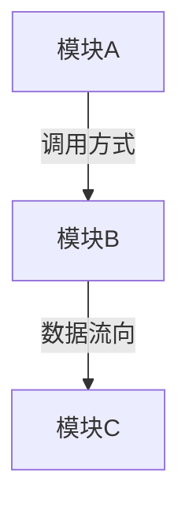

项目业务知识库。采用"索引 + 模块拆分"结构，专为 AI Agent 消费优化。通过指令前置、分层加载、强制引用三重策略，确保 AI 在长上下文场景下仍能有效利用业务知识。

**命令**: `/ctx-req` 或 `/project-context-requirements`

**参数**:
- `--change <name>` - 针对特定变更，自动识别涉及的模块并只加载相关知识文件
- `--update` - 强制重新生成全部文件
- `--module <name>` - 只更新指定模块的知识文件

**输出目录**: `openspec/project-context-requirements/`

### 工具调用约束（Read / trip-workflow 大文件）

执行本 skill 扫描 OpenSpec 时：

- `openspec/schemas/trip-workflow/schema.yaml` 常超过 **Read 单次约 10000 token** 上限。**禁止**不带 `offset`/`limit` 的整文件 Read。
- 需要工作流配置时：优先读 `openspec/config.yaml`（短小）。若必须读 `schema.yaml`，使用 **Read** 且 **`offset` 与 `limit` 均为正整数**（例如 `offset: 1, limit: 200` 分段续读），**禁止** `limit: -1`、负数或 0。
- 可用 **Bash** 的 `wc -l`、`head -n` / `tail -n` 再分段 Read。
- 业务知识库生成**不依赖** schema 全文；能由 `config.yaml` 与目录结构推断时，无需读完整个 `schema.yaml`。

---

## 核心定位

这份知识库是 **AI Agent 的业务参考资料 + 代码导航地图**。

**解决的问题**:
- AI 遇到业务术语不理解 → 查术语表
- AI 不清楚某模块的职责边界 → 查模块知识文件
- AI 需要理解某个业务逻辑的实现方式 → 通过代码索引定位源码，按需阅读
- AI 不知道用户当前怎么操作系统 → 查模块核心用例，理解现有交互流程
- AI 提出了已被否决的方案 → 查关键架构决策，了解历史选择及理由
- AI 提出的方案与现有接口不兼容 → 查模块关键 API 契约，了解已有接口的输入/输出结构
- AI 忽视了性能、安全等非功能性约束 → 查非功能性需求基线，评估方案对现有基线的影响
- AI 不了解异常路径和并发行为 → 查模块运行时行为与边界场景，了解已知的故障模式和防护机制
- AI 不知道哪些行为可配置 → 查模块配置项与特性开关，了解现有可调参数和开关惯例
- 大项目单文件知识库过大 → 按模块拆分，按需加载
- **AI 在长上下文中忽略知识库内容** → 指令前置 + 强制引用 + 输出校验

---

## AI Agent 有效消费策略

### 问题：为什么 AI 会忽略知识库？

1. **Lost in the Middle** — AI 对上下文中间部分的注意力最弱，开头和结尾最强
2. **信息过载** — 一次性加载太多内容，AI 无法区分优先级
3. **缺乏指令约束** — 文档只是"参考资料"，AI 没有被强制要求使用它
4. **无校验机制** — AI 即使忽略了知识库，也没有机制发现这个问题

### 策略 1：文档结构优化（写入时）

**指令区前置**: 每个文件开头放 `<!-- AI-INSTRUCTIONS -->` 区块，用指令性语言告诉 AI 必须做什么。这利用了 AI 对文档开头注意力最强的特点。

**信息密度控制**:
- `_index.md` 控制在 200 行以内，只放导航和高优先级信息
- 模块文件控制在 300 行以内，超出则拆分子模块
- 每个章节用 `<!-- PRIORITY: HIGH/MEDIUM/LOW -->` 标记优先级

**关键信息重复**: 最重要的业务规则同时出现在 `_index.md` 的跨模块规则和对应 `module-*.md` 中，确保无论 AI 读了哪个文件都能看到。

### 策略 2：分层加载协议（读取时）

```
Layer 0: _index.md 的 AI-INSTRUCTIONS 区块（~20 行）
  → 必读，包含强制检查清单和术语速查
  → 即使上下文很长，这部分也在最前面

Layer 1: _index.md 正文（~180 行）
  → 术语表、模块导航、跨模块规则
  → 足够回答"这个术语什么意思""这个需求涉及哪些模块"

Layer 2: 相关 module-{name}.md（按需，每个 ~300 行）
  → 只加载与当前任务相关的模块
  → 包含模块职责、业务规则、代码索引

Layer 3: 源码文件（按需，通过代码索引定位）
  → 只在需要确认实现细节时读取
  → 通过代码索引中的路径和行号精确定位
```

### 策略 3：消费者 Skill 侧强制引用（使用时）

在消费知识库的 skill（`/split-confirm`、`/clarify-confirm` 等）中，加入以下约束：

**强制读取规则**:
- 生成澄清问题前，必须先读取 `_index.md`
- 生成的每个澄清问题，必须标注"已参考知识库：是/否"
- 如果问题涉及知识库中已有的术语或规则，必须引用知识库条目

**输出校验规则**:
- 生成的澄清问题不得询问知识库术语表中已解释的概念
- 生成的需求描述必须使用知识库中定义的标准术语
- 如果需求涉及的模块在知识库中有记录，必须引用模块职责说明

---

## 输出文件结构

```
openspec/project-context-requirements/
├── _index.md                    # 索引文件（必须）：AI 指令 + 全局信息 + 模块导航
├── module-{name}.md             # 模块知识文件：每个业务模块一个
├── module-{name}.md
└── ...
```

### 拆分原则

- **索引文件 `_index.md`** 保持轻量（建议 < 200 行），只放全局信息
- **模块文件** 按项目的实际业务模块划分，每个文件聚焦一个模块（建议 < 300 行）
- 模块划分粒度：以目录结构中的顶层业务模块为准
- 如果项目较小（模块 ≤ 3 个），可以不拆分，全部写在 `_index.md` 中

---

## 执行流程

### 1. 检查知识库目录是否存在

检查固定路径：
```
openspec/project-context-requirements/_index.md
```

### 2. 如果存在且无 `--update` / `--module` 参数

直接读取 `_index.md` 并返回，结束执行。
（AI 后续根据 AI-INSTRUCTIONS 中的指引，自行读取对应的 `module-*.md`）

### 3. 如果不存在或有 `--update` 参数

执行完整项目扫描，生成索引文件和所有模块文件。

### 4. 如果有 `--module <name>` 参数

只重新扫描指定模块，更新对应的 `module-{name}.md`。

### 5. 如果有 `--change <name>` 参数

读取 `_index.md`，根据变更涉及的模块，只加载相关的 `module-*.md` 文件返回。

---

## 项目扫描流程

### 扫描排除规则

扫描项目文件时，**必须排除以下目录**：

- `openspec/` - OpenSpec 规格和变更目录，避免扫描生成的规格文档
- `node_modules/` - 依赖包目录
- `dist/`, `build/`, `.next/`, `out/` - 构建输出目录
- `.git/`, `.svn/` - 版本控制目录
- `coverage/`, `.nyc_output/` - 测试覆盖率输出
- `__tests__/`, `*.test.*`, `*.spec.*` - 测试文件（已在模块知识中体现，无需重复扫描源码）

**扫描范围**: 只扫描项目源代码和业务相关的配置文件，不扫描生成的文档、依赖包和构建产物。

### 3.1 识别模块划分

**扫描来源**:
- 顶层目录结构（`src/`、`web/`、`package/` 等）
- `src/` 下的子目录划分
- monorepo 中的包划分
- 路由/页面结构

**输出**: 确定模块列表，每个模块对应一个 `module-{name}.md`

### 3.2 为每个模块提取信息

对每个识别出的模块，提取以下内容：

#### 3.2.1 模块职责与边界
- 核心职责（做什么、不做什么）
- 对外暴露的接口/能力
- 与其他模块的依赖关系

#### 3.2.2 业务规则与约束
- 该模块内的校验逻辑、边界检查
- 状态流转规则
- 已做出的业务决策

#### 3.2.3 核心业务实体
- 该模块管理的实体及其含义
- 实体的生命周期
- 关键属性和关联关系

#### 3.2.4 核心用例
- 该模块承载的核心用例（用户通过该模块完成的关键任务）
- 每个用例包含：前置条件、主流程步骤、关键分支、后置条件
- 用例粒度：以用户可感知的完整操作为单位，不拆到按钮级别
- 提取来源：路由/页面结构、API 端点、事件处理流程、测试用例

#### 3.2.5 代码索引（按需）
- **生成条件**: 每个模块通常都有；文件数 < 5 的小模块可省略
- 关键文件路径及其职责说明
- 核心函数/类的位置和签名

#### 3.2.6 关键 API 契约（按需）
- **生成条件**: 仅对外暴露 API（HTTP 端点、SDK 方法、事件）的模块才生成，纯内部模块省略
- 用单表记录：API 名称、类型、路径/签名、关键输入/输出、错误场景

#### 3.2.7 运行时行为与边界场景（按需）
- **生成条件**: 仅存在并发访问、外部依赖调用、超时控制或已知故障模式的模块才生成
- 用单表记录：场景、当前行为、防护机制、已知限制

#### 3.2.8 配置项与特性开关（按需）
- **生成条件**: 仅有环境变量、配置文件参数或特性开关的模块才生成
- 用单表记录：配置项名称、类型、用途、默认值、是否必填

### 3.3 提取全局信息（写入 `_index.md`）

- AI 指令区块（强制检查清单）
- 项目概述和定位
- 业务术语表（全局通用的术语）
- 模块关系图
- 跨模块的业务规则
- 关键架构决策（选择、否决方案及理由）
- 非功能性需求基线（性能、安全、可用性等现有约束）
- 模块导航表（指向各 `module-*.md`）
- 已有变更记录摘要
- 第三方集成

---

## 索引文件模板 (`_index.md`)

```markdown
<!-- AI-INSTRUCTIONS
⚠️ 你正在阅读项目业务知识库。在进行需求理解、澄清问题生成、需求确认时，你必须遵守以下规则：

1. 【术语检查】生成任何输出前，先检查下方术语表。如果需求中出现的术语在表中有定义，直接使用该定义，不要提出"什么是 XX？"类的问题。
2. 【模块定位】根据需求内容，在"模块导航"表中找到涉及的模块，读取对应的 module-*.md 获取详细知识。
3. 【规则遵守】"跨模块业务规则"中的规则是已确定的约束，生成的方案不得违反这些规则。
4. 【决策尊重】"关键架构决策"中记录了已做出的技术选型及被否决的替代方案。生成方案时不得重新提出已被否决的方案，除非有明确的新约束推翻原有理由。
5. 【非功能性约束】"非功能性需求基线"记录了现有的性能、安全、可用性等约束。新方案必须评估对这些基线的影响，不得在未说明影响的情况下引入可能冲击基线的变更。
6. 【引用标注】生成澄清问题时，如果问题与知识库中已有信息相关，在问题末尾标注 [ref: 术语/规则/模块名/决策/NFR]。
7. 【禁止重复】不得询问知识库中已明确回答的内容。
-->

# 项目业务知识库

生成时间: {ISO 8601}
项目: {项目名称}

---

## 1. 项目概述

**项目定位**: {一句话描述}
**核心业务领域**: {业务领域}
**目标用户**: {用户群体}

## 2. 业务术语表

<!-- PRIORITY: HIGH — AI 必须在生成任何输出前检查此表 -->

| 术语 | 含义 | 上下文说明 | 易混淆项 |
|------|------|-----------|----------|
| {术语} | {准确含义} | {在本项目中的具体用法} | {容易混淆的概念及区别} |

## 3. 模块导航

| 模块 | 知识文件 | 职责概述 | 核心目录 |
|------|----------|----------|----------|
| {模块名} | `module-{name}.md` | {一句话职责} | `{目录路径}` |

## 4. 模块关系图



### 关键协作场景

| 场景 | 参与模块 | 交互方式 | 数据流向 |
|------|----------|----------|----------|
| {场景} | {模块列表} | {调用/事件/共享} | {数据如何流转} |

## 5. 跨模块业务规则

<!-- PRIORITY: HIGH — 这些规则是硬约束，生成的方案不得违反 -->

| 规则 | 说明 | 涉及模块 | 来源 |
|------|------|----------|------|
| {规则} | {详细说明} | {模块列表} | {决策来源} |

## 6. 关键架构决策

<!-- PRIORITY: HIGH — 生成方案时不得重新提出已被否决的替代方案，除非有新约束推翻原有理由 -->

| 决策主题 | 当前选择 | 否决方案 | 选择理由 | 涉及模块 |
|----------|---------|---------|---------|----------|
| {主题} | {采用的方案} | {曾考虑但否决的方案} | {为什么选 A 不选 B} | {模块列表} |

## 7. 非功能性需求基线

<!-- PRIORITY: HIGH — 新方案必须评估对以下基线的影响 -->

### 性能约束
| 指标 | 当前基线 | 测量方式 | 备注 |
|------|---------|---------|------|
| {指标名，如响应时间/吞吐量} | {当前值或量级} | {如何测量} | {触发条件或上下文} |

### 安全与合规
| 要求 | 说明 | 涉及模块 |
|------|------|----------|
| {要求，如认证方式/数据加密/权限模型} | {当前实现方式} | {模块列表} |

### 可用性与部署约束
| 约束 | 说明 | 来源 |
|------|------|------|
| {约束，如部署方式/运行环境/依赖限制} | {具体要求} | {决策来源} |

### 兼容性
| 维度 | 要求 | 说明 |
|------|------|------|
| {维度，如浏览器/Node 版本/API 向后兼容} | {具体要求} | {影响范围} |

## 8. 已有变更记录摘要

| 变更名 | 业务目标 | 涉及模块 | 关键业务决策 |
|--------|----------|----------|-------------|
| {名称} | {解决什么业务问题} | {模块} | {做了什么决策、为什么} |

## 9. 第三方集成

| 服务/工具 | 业务用途 | 集成方式 | 使用模块 |
|-----------|----------|----------|----------|
| {服务} | {在业务中扮演什么角色} | {SDK/API/MCP} | {哪些模块在用} |
```

---

## 模块知识文件模板 (`module-{name}.md`)

章节分为**必填**（每个模块都生成）和**按需**（仅在该模块有实质内容时生成）两类。必填章节在前，按需章节在后，利用 AI 对文档前半部分注意力更强的特点。

```markdown
<!-- AI-INSTRUCTIONS
⚠️ 你正在阅读 [{模块名}] 模块的业务知识。

关键约束（必须遵守）:
- {该模块最重要的 1-3 条业务规则，用一句话概括}

核心用例: 该模块承载 {N} 个核心用例，新需求需明确是修改已有用例还是新增用例

代码导航: 入口 `{path}` | 核心逻辑 `{path}` | 类型定义 `{path}`
-->

# 模块: {模块名}

所属目录: `{目录路径}`
最后更新: {ISO 8601}

---

<!-- ═══ 必填章节（每个模块都包含）═══ -->

## 1. 模块职责

- **职责**: {这个模块做什么}
- **不负责**: {明确不属于这个模块的事情}
- **核心能力**: {模块提供的关键功能列表}
- **对外接口**: {其他模块如何与它交互}

## 2. 业务术语（模块特有）

| 术语 | 含义 | 上下文说明 |
|------|------|-----------|
| {术语} | {含义} | {在本模块中的用法} |

## 3. 业务规则与约束

<!-- PRIORITY: HIGH -->

### 业务规则
| 规则 | 说明 | 来源 |
|------|------|------|
| {规则} | {详细说明} | {决策来源} |

### 流程约束
| 流程 | 约束 | 原因 |
|------|------|------|
| {流程} | {条件} | {原因} |

### 数据约束
| 数据/字段 | 约束 | 说明 |
|-----------|------|------|
| {字段} | {取值范围/格式} | {业务原因} |

## 4. 核心业务实体

### {实体名}
- **含义**: {代表什么}
- **生命周期**: {创建 → 状态变化 → 终态}
- **关键属性**: {重要属性及含义}
- **关联实体**: {关系说明}

## 5. 核心用例

<!-- PRIORITY: HIGH — AI 理解新 PRD 时，必须先了解该模块当前承载的用户操作流程 -->

### 用例: {用例名称}

- **触发者**: {用户/系统/定时任务}
- **前置条件**: {执行此操作前必须满足的条件}
- **主流程**:
  1. {步骤 1}
  2. {步骤 2}
  3. {步骤 3}
  ...
- **关键分支**:
  - {条件} → {分支处理}
- **后置条件**: {操作完成后系统的状态变化}
- **涉及的关键函数**: `{functionName}`（参见代码索引）

## 6. 与其他模块的交互

| 交互模块 | 方向 | 方式 | 说明 |
|----------|------|------|------|
| {模块名} | 调用/被调用 | {import/API/事件} | {交互内容} |

<!-- ═══ 按需章节（仅在该模块有实质内容时生成，无内容则整节省略）═══ -->

## 7. 代码索引

<!-- 生成条件: 每个模块通常都有，小模块（< 5 个文件）可省略此节 -->

| 文件 | 职责 | 核心导出 |
|------|------|----------|
| `{path/file.ts}` | {做什么} | `{函数/类名}` |

核心函数:
| 名称 | 位置 | 签名 | 业务含义 |
|------|------|------|----------|
| `{name}` | `{file.ts}:{line}` | `{签名}` | {做什么} |

## 8. 关键 API 契约

<!-- 生成条件: 仅对外暴露 API（HTTP/SDK/事件）的模块才生成。纯内部模块省略 -->

| API | 类型 | 路径/签名 | 关键输入 | 关键输出 | 错误场景 |
|-----|------|-----------|---------|---------|---------|
| {名称} | {HTTP/SDK/事件} | `{路径或签名}` | {关键字段及类型} | {关键字段及类型} | {主要错误} |

## 9. 运行时行为与边界场景

<!-- 生成条件: 仅存在并发访问、外部依赖调用、超时控制、已知故障模式的模块才生成 -->

| 场景 | 当前行为 | 防护机制 | 已知限制 |
|------|---------|---------|---------|
| {并发/超时/故障场景} | {如何处理} | {锁/重试/降级/无} | {风险或限制} |

## 10. 配置项与特性开关

<!-- 生成条件: 仅有环境变量、配置文件参数或特性开关的模块才生成 -->

| 配置项 | 类型 | 用途 | 默认值 | 必填 |
|--------|------|------|--------|------|
| `{名称}` | {环境变量/配置文件/特性开关} | {用途} | {默认值} | {是/否} |
```

---

## AI 使用流程

### 分层加载协议

```
Layer 0: _index.md 的 AI-INSTRUCTIONS（~20 行）
  → 必读。包含强制检查清单和行为约束。
  → 利用 AI 对文档开头注意力最强的特点。

Layer 1: _index.md 正文（~180 行）
  → 术语表、模块导航、跨模块规则。
  → 足够回答"这个术语什么意思""这个需求涉及哪些模块"。

Layer 2: 相关 module-{name}.md（按需，每个 ~300 行）
  → 只加载与当前任务相关的模块。
  → 先读 AI-INSTRUCTIONS 获取关键约束，再读正文。

Layer 3: 源码文件（按需，通过代码索引定位）
  → 只在需要确认实现细节时读取。
  → 通过代码索引中的路径和行号精确定位。
```

### 在工作流中的使用

#### 在 /split-clarify 前调用

```bash
# 生成业务知识库
/ctx-req

# AI 自动参考知识库进行需求拆分
/split-clarify ./resource --name-prefix myproject
```

#### 在 /split-confirm 生成澄清问题时参考

`/split-confirm` 生成 `clarification-questions.json` 时，必须：
1. 读取 `_index.md`，执行 AI-INSTRUCTIONS 中的检查清单
2. 根据变更涉及的模块，读取对应的 `module-*.md`
3. 生成的每个问题检查：是否在术语表中已有答案？是否违反已有业务规则？
4. 对涉及知识库已有信息的问题，标注 `[ref: ...]`

#### 在 /clarify-confirm 生成确认文档时参考

确认文档生成时参考知识库，确保：
- 使用知识库中定义的标准术语
- 符合已有的模块职责划分
- 不违反已确定的业务规则

---

## 消费者 Skill 集成指南

### 如何在其他 Skill 中引用知识库

在消费知识库的 skill 中，添加以下规则段落：

```markdown
### 业务知识库引用规则

在执行本 skill 前，必须：

1. **读取知识库**: 读取 `_index.md`，根据需求涉及的模块加载对应 `module-*.md`
2. **术语 + 规则 + 决策**: 检查术语表、遵守业务规则和跨模块规则、尊重已有架构决策
3. **理解现有用例**: 阅读相关模块的核心用例，明确新需求是修改已有用例还是新增
4. **评估非功能性影响**: 新方案需评估对 NFR 基线（性能/安全/兼容性）的影响
5. **标注引用**: 输出中涉及知识库内容时，标注 `[ref: 知识库条目]`

**按需深度检查**（仅在对应场景下执行）:
- 涉及接口变更 → 检查模块"关键 API 契约"的兼容性
- 涉及并发/容错 → 检查模块"运行时行为与边界场景"的已有防护机制
- 涉及新配置项 → 检查模块"配置项与特性开关"的现有惯例

**校验清单**（生成输出前自检）:
- [ ] 术语表已检查，输出使用标准术语
- [ ] 相关模块知识和核心用例已阅读
- [ ] 输出不违反业务规则、不重复提出已否决方案
- [ ] 已评估 NFR 基线影响
- [ ] 未询问知识库已回答的内容
```

---

## 向后兼容

如果项目已有旧版单文件 `openspec/project-context-requirements.md`：
- 执行 `/ctx-req --update` 时，自动迁移为目录结构
- 旧文件会被移动到 `openspec/project-context-requirements/_legacy.md` 作为备份
- 其他 skill 中引用旧路径的，改为读取 `_index.md`

---

## 护栏

- **目录位置固定** - 必须存储在 `openspec/project-context-requirements/`
- **索引文件轻量** - `_index.md` 建议 < 250 行，只放全局信息和导航
- **模块文件限制** - 每个 `module-*.md` 建议 < 300 行，超出则拆分子模块
- **必填章节不可省略** - 模块的章节 1-6（职责、术语、规则、实体、用例、交互）每个模块都必须生成
- **按需章节条件生成** - 章节 7-10（代码索引、API 契约、运行时行为、配置项）仅在该模块有实质内容时生成，无内容则整节省略，不生成空表格占位
- **AI 指令前置** - 每个文件必须以 `<!-- AI-INSTRUCTIONS -->` 开头
- **优先级标记** - 关键章节用 `<!-- PRIORITY: HIGH -->` 标记
- **按需加载** - AI 不应一次性读取所有模块文件，根据需求按需加载
- **代码索引非代码** - 代码索引只记录路径、签名和业务含义，不复制源码内容
- **增量更新** - 支持 `--module` 参数只更新单个模块
- **非阻塞** - 扫描失败不中断流程
- **只读分析** - 不修改任何项目文件
- **小项目兼容** - 模块 ≤ 3 个时可不拆分，全部写在 `_index.md` 中
