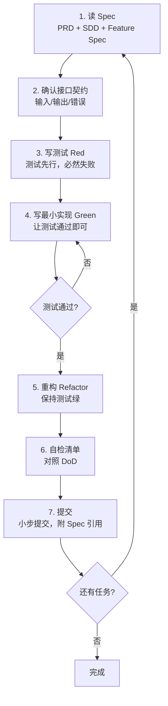

# AI 开发 Harness 总纲

> 本文档是「全程 AI 开发」的最高纲领。**任何 AI 编码会话开始前，必须先阅读本文件。**
> 目标：让能力一般的模型也能稳定产出高质量、可验证、不跑偏的代码。

---

## 0. 为什么需要 Harness？

全程用 AI 写代码的最大风险是 **模型跑偏、幻觉、上下文丢失、改坏已有功能**。
Harness（约束框架/护栏）通过三道防线解决：

```
第一道：Spec 约束    —— 写代码前，先有明确的"做什么"（PRD/SDD/Feature Spec）
第二道：TDD 验证     —— 先写测试定义"对错"，让 AI 产出可被自动判定
第三道：任务切片     —— 一次只让 AI 做一个最小可验证单元（TASKS）
```

> 一句话：**Spec 管方向，Test 管对错，小任务管可控。**

---

## 1. 核心方法论

### 1.1 SDD（Spec-Driven Development，规格驱动开发）
- **先写规格，后写代码。** 代码是规格的实现，不是灵感的产物。
- 规格分三层：
  - `01-PRD.md`：**产品层**——要给用户解决什么问题（What & Why）。
  - `02-SDD.md`：**设计层**——系统怎么拆、接口怎么定（How，全局）。
  - `features/*.md`：**特性层**——单个功能的精确契约（How，局部）。
- AI 写任何代码前，必须引用对应的 Spec 章节。**Spec 没写的，不要自由发挥。**

### 1.2 TDD（Test-Driven Development，测试驱动开发）
- **Red → Green → Refactor** 循环（详见 `03-TDD-GUIDE.md`）。
- 每个功能：先写测试（定义验收）→ 让 AI 写实现直到测试通过 → 重构。
- 好处：能力一般的模型也有明确"通过/不通过"信号，避免"看起来对其实错"。

### 1.3 任务切片（Task Slicing）
- 把大需求切成 **30 分钟内可完成、可独立验证** 的小任务（见 `04-TASKS.md`）。
- AI 一次只领一个任务，做完跑测试，绿了再领下一个。
- 禁止"一口气把整个模块写完"——上下文越长，模型越容易崩。

---

## 2. 标准 AI 开发工作流（每个功能都走这套）



### 每一步对 AI 的指令模板

| 步骤 | 给 AI 的话术 |
|------|------------|
| 读 Spec | "阅读 `specs/features/F01.md`，复述你将实现的接口契约，不要写代码。" |
| 写测试 | "根据该 Spec 的验收标准，先写测试文件，覆盖正常/边界/异常。不要写实现。" |
| 写实现 | "现在写最小实现让上面的测试全部通过。只改 `xxx.ts`，不要动其他文件。" |
| 重构 | "在保持测试全绿的前提下，重构提升可读性。" |
| 自检 | "对照 `00-AI-HARNESS.md` 第 5 节 DoD 自查，逐条回答是否满足。" |

---

## 3. 给 AI 的硬性约束（护栏）

> 这些是 **MUST**，违反即视为任务失败。详细行为规则见根目录 `AGENTS.md`。

1. **不改 Spec 之外的范围**：只实现当前任务要求的，不顺手"优化"别处。
2. **不删测试来让测试通过**：测试是契约，改测试必须先改 Spec。
3. **一次只动一个文件/模块**：除非任务明确要求跨文件。
4. **不引入未在 SDD 声明的依赖**：新依赖必须先更新 `02-SDD.md`。
5. **不写占位/TODO 蒙混**：要么实现，要么明确报告"无法实现及原因"。
6. **不臆造接口**：调用任何函数/API 前，必须确认其真实签名（读代码或读 Spec）。
7. **每次产出必须可验证**：附上"如何运行测试验证"的命令。

---

## 4. 文档体系导航

| 文件 | 角色 | 何时读 |
|------|------|--------|
| `00-AI-HARNESS.md`（本文件） | 总纲/工作流 | 每次会话开始 |
| `01-PRD.md` | 产品需求/用户故事 | 理解"做什么、为谁做" |
| `02-SDD.md` | 系统设计/接口契约/数据模型 | 写任何代码前 |
| `03-TDD-GUIDE.md` | 测试规范 | 写测试前 |
| `04-TASKS.md` | 任务清单/进度 | 领任务时 |
| `features/F*.md` | 单功能精确契约 | 实现具体功能时 |
| `../AGENTS.md` | AI 行为规则 | 工具自动加载 |

---

## 5. Definition of Done（DoD，完成定义）

一个任务只有**全部满足**以下条件才算"完成"：

- [ ] 对应 Feature Spec 的所有验收标准（AC）都已实现
- [ ] 所有相关测试通过（含正常 / 边界 / 异常用例）
- [ ] 测试覆盖率达标（核心逻辑 ≥ 80%）
- [ ] 没有引入 Spec 之外的改动
- [ ] 没有遗留 TODO / 占位代码 / 注释掉的废码
- [ ] 通过 lint，无类型错误
- [ ] 关键决策/偏差已记录（若与 Spec 不符，已更新 Spec）
- [ ] 提交信息引用了对应 Spec / Task 编号

---

## 6. 当 AI 卡住时的升级路径（Escalation）

能力一般的模型容易陷入"反复改还是错"的循环。设定止损：

1. **同一测试连续 3 次没修复** → 停止改代码，回去重读 Spec，检查是不是理解错了契约。
2. **Spec 本身有歧义** → 停止编码，向人类提问，更新 Spec 后再继续。
3. **任务太大改不动** → 把任务进一步切小，更新 `04-TASKS.md`。
4. **依赖/环境问题** → 报告具体错误，不要用 hack 绕过。

> 原则：**宁可停下来问清楚，也不要瞎改制造技术债。**

---

## 7. 上下文管理（针对长会话/弱模型）

- 每个新任务开始，**重新喂入**：本文件 + 对应 Feature Spec + 相关现有代码片段。
- 不要依赖模型"记得"几十轮前的内容。
- 任务完成后，让 AI 用 3-5 行**总结本次改动**，作为下次上下文锚点。
- 复杂功能拆分到 `features/` 单独文件，避免单个 Spec 过长撑爆上下文。
