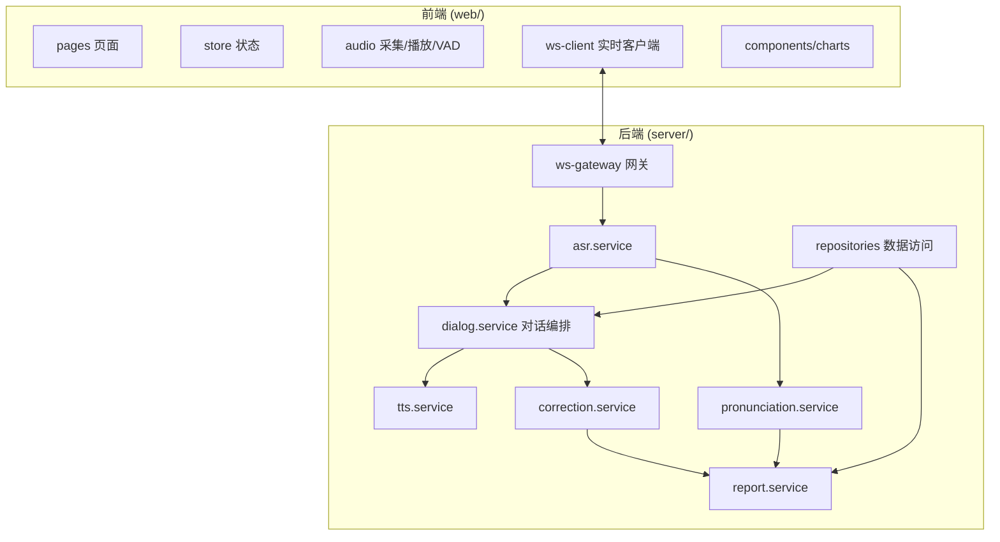
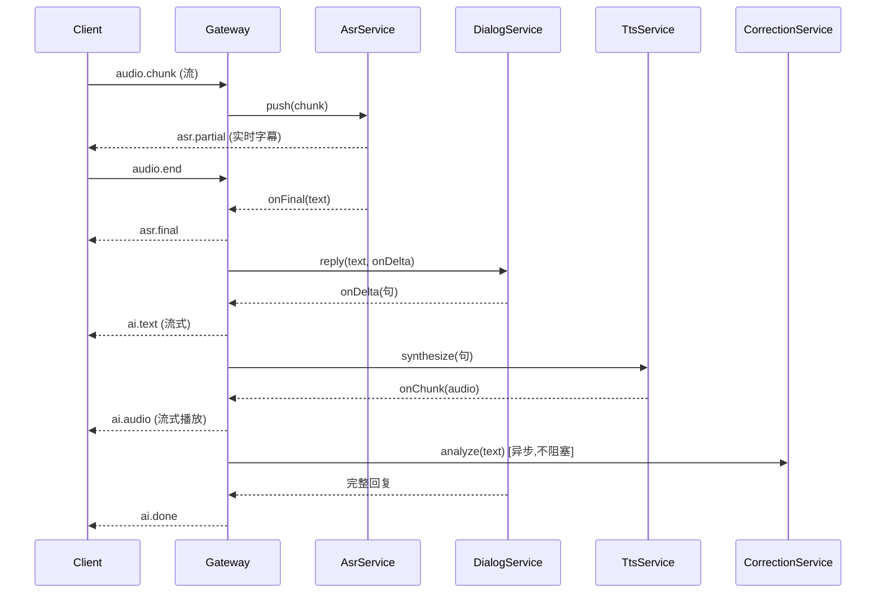

# SDD · 系统设计与规格说明

> Software Design / Spec Document。回答"**系统怎么拆、模块怎么连、接口长什么样、数据怎么存**"。
> 这是 AI 写代码的**契约源头**。任何接口实现必须与本文一致；要改接口，先改本文。

---

## 1. 系统总览

### 1.1 技术栈（锁定，不得擅自更换）

| 层 | 技术 | 版本约束 |
|----|------|---------|
| 前端框架 | React + TypeScript + Vite | React 18 |
| 样式 | Tailwind CSS | v3 |
| 状态管理 | Zustand | latest |
| 音频/VAD | Web Audio API + `@ricky0123/vad-web` | latest |
| 图表 | Recharts | latest |
| 后端 | Node.js + NestJS（TypeScript） | Node 20 LTS |
| 实时通信 | WebSocket（ws / socket.io） | - |
| 数据库 | PostgreSQL（开发期可用 SQLite） | - |
| 缓存 | Redis（开发期可用内存 Map） | - |
| AI - 对话 | OpenAI Realtime API / GPT-4o | - |
| AI - 发音评测 | Azure Pronunciation Assessment | - |
| AI - 总结 | GPT-4o | - |

> 新增任何依赖，必须先在本节登记并说明理由。

### 1.2 模块划分与边界



**模块职责（单一职责，禁止越界）：**

| 模块 | 职责 | 不负责 |
|------|------|--------|
| `ws-gateway` | 管理 WebSocket 连接、消息路由 | 业务逻辑 |
| `asr.service` | 音频流 → 文本（流式） | 对话决策 |
| `dialog.service` | 角色 prompt、上下文、调用 LLM 生成回复 | 语音转换 |
| `pronunciation.service` | 调 Azure 做发音评分 | 语法纠错 |
| `correction.service` | 语法纠错 + 表达升级（异步） | 发音 |
| `tts.service` | 文本 → 语音（流式） | 文本生成 |
| `report.service` | 聚合一次会话数据生成报告 | 实时对话 |
| `repositories` | 数据库读写 | 业务规则 |

---

## 2. 目录结构（锁定）

```
.
├── web/                         # 前端
│   ├── src/
│   │   ├── pages/               # ScenarioHub / Conversation / Report
│   │   ├── components/          # 通用组件 + charts
│   │   ├── store/               # zustand stores
│   │   ├── audio/               # recorder / player / vad
│   │   ├── ws-client/           # WebSocket 封装
│   │   ├── types/               # 共享类型（与后端对齐）
│   │   └── lib/                 # 工具函数
│   └── tests/                   # 前端测试
├── server/                      # 后端
│   ├── src/
│   │   ├── gateway/             # ws 网关
│   │   ├── modules/             # 各 service（按上表）
│   │   ├── repositories/        # 数据访问
│   │   ├── types/               # 共享类型
│   │   └── lib/                 # 工具/AI 客户端封装
│   └── tests/                   # 后端测试
├── shared/                      # 前后端共享的类型契约
│   └── contracts.ts
└── specs/                       # 本规范体系
```

> **类型契约统一放 `shared/contracts.ts`**，前后端都从这里 import，保证一致。

---

## 3. 核心数据模型（Data Model）

```ts
// shared/contracts.ts

/** 场景 */
export interface Scenario {
  id: string;                    // 'interview' | 'restaurant' | 'meeting'
  title: string;
  description: string;
  difficulty: 'beginner' | 'intermediate' | 'advanced';
  rolePrompt: string;            // AI 扮演角色的 system prompt
  goal: string;                  // 本场景对话目标
}

/** 一次完整练习会话 */
export interface Session {
  id: string;
  scenarioId: string;
  difficulty: Scenario['difficulty'];
  startedAt: number;             // epoch ms
  endedAt?: number;
  overallScore?: number;         // 0-100
}

/** 对话轮次 */
export interface Turn {
  id: string;
  sessionId: string;
  role: 'user' | 'ai';
  text: string;
  audioUrl?: string;
  timestamp: number;
}

/** 发音评测结果（对应 user turn） */
export interface PronunciationResult {
  turnId: string;
  accuracy: number;              // 0-100
  fluency: number;
  completeness: number;
  prosody: number;
  wordScores: Array<{ word: string; score: number; error?: string }>;
}

/** 纠错结果 */
export interface Correction {
  turnId: string;
  original: string;
  corrected: string;
  errorType: string;             // e.g. 'grammar' | 'word_choice' | 'expression'
  severity: 'blocking' | 'major' | 'minor';
  explanation: string;
  betterExpression?: string;     // 地道升级
}

/** 课后报告 */
export interface Report {
  sessionId: string;
  radar: {
    pronunciation: number;
    fluency: number;
    grammar: number;
    vocabulary: number;
    taskCompletion: number;
  };
  topErrors: Array<{ errorType: string; count: number; example: string }>;
  expressionUpgrades: Array<{ from: string; to: string }>;
  summaryText: string;
  annotatedTurns: Array<Turn & { corrections: Correction[] }>;
}
```

> 数据模型是**唯一事实来源**。AI 不得自行新增/改名字段；需要变更先改本节。

---

## 4. WebSocket 消息契约（实时对话核心）

> 所有实时消息走 WebSocket，使用 `{ type, payload }` 信封格式。

### 4.1 客户端 → 服务端

| type | payload | 说明 |
|------|---------|------|
| `session.start` | `{ scenarioId, difficulty }` | 开始会话 |
| `audio.chunk` | `{ data: ArrayBuffer, seq: number }` | 音频流分片 |
| `audio.end` | `{}` | VAD 检测说话结束，触发回合 |
| `session.end` | `{}` | 结束会话，触发报告生成 |

### 4.2 服务端 → 客户端

| type | payload | 说明 |
|------|---------|------|
| `session.started` | `{ sessionId, greeting: string }` | 会话已建，含 AI 开场白 |
| `asr.partial` | `{ text }` | 流式识别中间结果 |
| `asr.final` | `{ turnId, text }` | 识别最终结果 |
| `ai.text` | `{ turnId, deltaText }` | AI 回复文本（流式增量） |
| `ai.audio` | `{ turnId, data: ArrayBuffer, seq }` | AI 回复语音分片 |
| `ai.done` | `{ turnId }` | 本轮 AI 回复结束 |
| `report.ready` | `{ report: Report }` | 报告生成完成 |
| `error` | `{ code, message }` | 错误 |

> 错误码集中定义在 `shared/contracts.ts` 的 `ErrorCode` 枚举。

---

## 5. 关键服务接口契约（Service API）

> 以下为后端 service 的方法签名契约。实现必须与此一致。

```ts
// asr.service
interface IAsrService {
  /** 开启一路流式识别，返回可写入音频与监听结果的会话句柄 */
  createStream(): AsrStream;
}
interface AsrStream {
  push(chunk: ArrayBuffer): void;
  onPartial(cb: (text: string) => void): void;
  onFinal(cb: (text: string) => void): void;
  close(): Promise<void>;
}

// dialog.service
interface IDialogService {
  /** 生成开场白 */
  greet(scenario: Scenario): Promise<string>;
  /** 流式生成 AI 回复；onDelta 按句/词回调 */
  reply(
    sessionId: string,
    userText: string,
    onDelta: (delta: string) => void
  ): Promise<string>; // 返回完整回复文本
}

// pronunciation.service
interface IPronunciationService {
  assess(audio: ArrayBuffer, referenceText: string): Promise<PronunciationResult>;
}

// correction.service
interface ICorrectionService {
  /** 异步分析一句用户发言，返回 0..n 条纠错 */
  analyze(text: string): Promise<Correction[]>;
}

// tts.service
interface ITtsService {
  /** 流式合成，onChunk 回调音频分片 */
  synthesize(text: string, onChunk: (chunk: ArrayBuffer) => void): Promise<void>;
}

// report.service
interface IReportService {
  generate(sessionId: string): Promise<Report>;
}
```

---

## 6. 关键时序：一轮对话



---

## 7. 错误处理与降级策略

| 场景 | 策略 |
|------|------|
| ASR 超时/失败 | 返回 `error`，前端提示"没听清，请重说" |
| LLM 超时 | 重试 1 次，仍失败则返回兜底话术 |
| TTS 失败 | 降级为纯文字字幕（不阻断对话） |
| 发音评测失败 | 该维度用 LLM 估算兜底，报告标注"估算" |
| 网络断开 | 前端自动重连 WebSocket，恢复会话状态 |

---

## 8. 配置与密钥

- 所有 API Key 走环境变量（`.env`），**禁止硬编码**。
- 提供 `.env.example` 列出所需变量：`OPENAI_API_KEY`、`AZURE_SPEECH_KEY`、`AZURE_SPEECH_REGION` 等。
- AI 客户端封装在 `server/src/lib/`，业务模块只依赖接口，便于 mock 测试。

---

## 9. 给 AI 的设计约束（MUST）

1. 前后端共享类型一律从 `shared/contracts.ts` import，不重复定义。
2. service 之间通过接口依赖，构造时注入，便于测试 mock。
3. 不在 service 里直接 new AI 客户端，统一从 `lib/` 注入。
4. 任何对外部 AI 的调用都要可被 mock（测试不依赖真实网络）。
5. 改动接口签名前，先更新本文件第 5 节并说明影响面。
