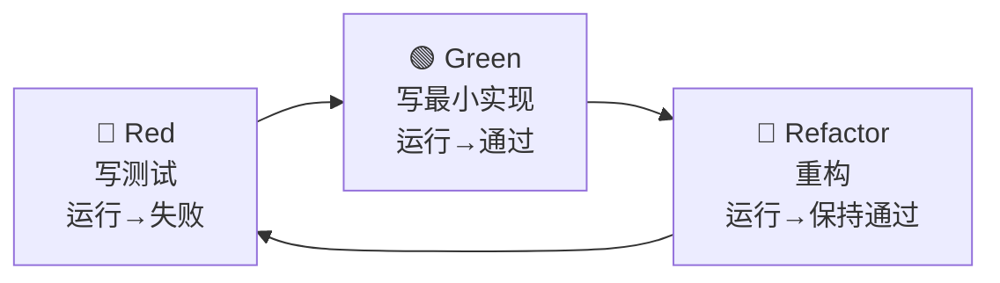

# TDD · 测试驱动开发规范

> 让能力一般的模型也能"知道自己对没对"。**测试是给 AI 的客观评分器。**
> 核心循环：**Red（写失败的测试）→ Green（写最小实现让它通过）→ Refactor（重构保持绿）**。

---

## 1. 为什么 AI 开发更需要 TDD？

- 模型会"自信地写错"，但测试不会撒谎——绿了就是绿了。
- 测试先行 = 把"验收标准"翻译成机器可判定的代码，**逼 AI 在写代码前先想清楚契约**。
- 防回归：弱模型改 A 容易弄坏 B，测试套件是安全网。

> 铁律：**没有失败过的测试不算测试**（先看到 Red，才证明测试有效）。

---

## 2. 标准 TDD 循环（每个功能照做）



### 给 AI 的分步指令（严格按序，不许跳步）

```
步骤 1（Red）：
"根据 specs/features/F0X.md 的验收标准 AC1..ACn，为 <模块> 编写测试。
 覆盖：正常路径、边界值、异常输入。先不要写任何实现代码。
 然后运行测试，确认它们因'功能未实现'而失败，把失败输出贴给我。"

步骤 2（Green）：
"现在编写最小实现，目标只有一个：让上述测试全部通过。
 不要实现测试没覆盖的功能。只修改 <指定文件>。运行测试，贴出全绿结果。"

步骤 3（Refactor）：
"在保持所有测试通过的前提下，重构代码提升可读性与结构。
 每次小改动后重新运行测试，确保始终是绿的。"
```

---

## 3. 测试技术栈与约定

| 项 | 约定 |
|----|------|
| 框架 | Vitest（前后端统一，与 Vite 生态契合） |
| 文件命名 | `<被测文件名>.test.ts`，与源码同目录或 `tests/` 镜像 |
| 断言风格 | `expect().toBe()` / `.toEqual()` / `.toThrow()` |
| Mock | `vi.fn()` / `vi.mock()`；外部 AI 调用一律 mock |
| 运行命令 | `npm test`（全量）/ `npm test -- <file>`（单文件） |
| 覆盖率 | `npm run test:coverage`，核心逻辑 ≥ 80% |

---

## 4. 测试分层

| 层级 | 范围 | 是否 mock 外部 | 重点 |
|------|------|---------------|------|
| 单元测试 | 单个函数/service 方法 | 是（mock AI/DB） | 业务逻辑、边界、异常 |
| 集成测试 | 多模块协作（如 gateway→dialog） | 部分 mock | 消息流转、契约对齐 |
| 契约测试 | WebSocket 消息格式 | - | 收发消息符合 SDD 第 4 节 |
| E2E（少量） | 一条主链路 | 否或录制 | 演示主路径可用 |

> 黑客松时间紧：**优先单元测试 + 关键契约测试**，E2E 只覆盖"开口→对话→报告"这一条 happy path。

---

## 5. 每个测试必须覆盖的三类用例

> AI 写测试时，必须问自己这三类是否都有：

1. **正常路径（Happy Path）**：合法输入 → 期望输出。
2. **边界值（Boundary）**：空值、最大/最小、临界（如发音分 0 和 100）。
3. **异常路径（Error）**：非法输入、依赖失败（如 AI 接口抛错）→ 是否优雅处理。

---

## 6. 示例：`correction.service` 的测试（Red 阶段）

```ts
// server/src/modules/correction.service.test.ts
import { describe, it, expect, vi, beforeEach } from 'vitest';
import { CorrectionService } from './correction.service';
import type { LlmClient } from '../lib/llm-client';

describe('CorrectionService.analyze', () => {
  let llm: LlmClient;
  let svc: CorrectionService;

  beforeEach(() => {
    llm = { complete: vi.fn() } as unknown as LlmClient;
    svc = new CorrectionService(llm);
  });

  it('正常路径：返回结构化纠错结果', async () => {
    (llm.complete as any).mockResolvedValue(JSON.stringify([{
      original: 'I very like it', corrected: 'I really like it',
      errorType: 'word_choice', severity: 'minor',
      explanation: "用 really 修饰动词", betterExpression: 'I really enjoy it',
    }]));
    const res = await svc.analyze('I very like it');
    expect(res).toHaveLength(1);
    expect(res[0].corrected).toBe('I really like it');
    expect(res[0].severity).toBe('minor');
  });

  it('边界：完全正确的句子返回空数组', async () => {
    (llm.complete as any).mockResolvedValue('[]');
    const res = await svc.analyze('I really like it.');
    expect(res).toEqual([]);
  });

  it('异常：LLM 返回非法 JSON 时不抛出，降级为空数组', async () => {
    (llm.complete as any).mockResolvedValue('not a json');
    const res = await svc.analyze('whatever');
    expect(res).toEqual([]); // 优雅降级
  });

  it('异常：LLM 调用抛错时向上传播明确错误', async () => {
    (llm.complete as any).mockRejectedValue(new Error('network'));
    await expect(svc.analyze('x')).rejects.toThrow('network');
  });
});
```

> 注意：测试**只依赖 SDD 定义的接口契约**（`Correction` 类型、`analyze` 签名），不依赖真实 LLM。

---

## 7. AI 在 TDD 中的硬性禁令

1. **禁止为了过测试而删/改测试**（除非 Spec 变更并已同步）。
2. **禁止 mock 掉被测对象本身**（只 mock 它的依赖）。
3. **禁止写"永远通过"的空测试**（如只 `expect(true).toBe(true)`）。
4. **禁止跳过 Red 直接写实现**。
5. **禁止用 `// @ts-ignore`、`any` 滥用绕过类型**。

---

## 8. 完成判定（与 DoD 对齐）

一个功能 TDD 完成的标志：
- [ ] 三类用例（正常/边界/异常）齐全
- [ ] 全部测试绿
- [ ] 覆盖率达标
- [ ] 重构后测试仍绿
- [ ] 测试只依赖契约，不依赖真实外部服务
