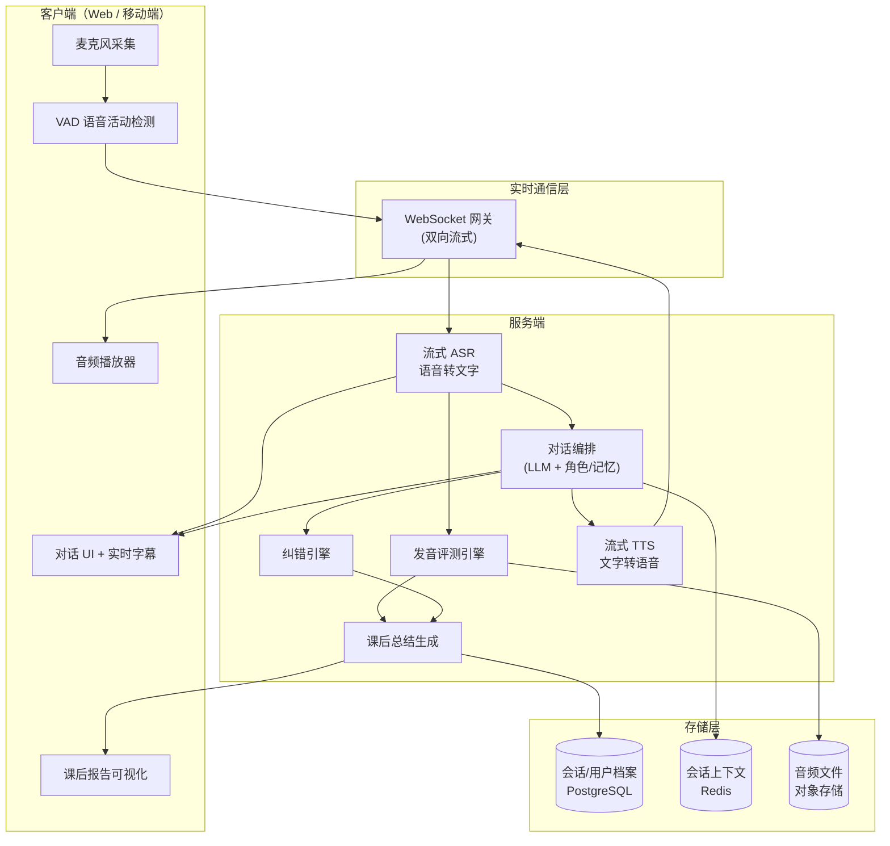
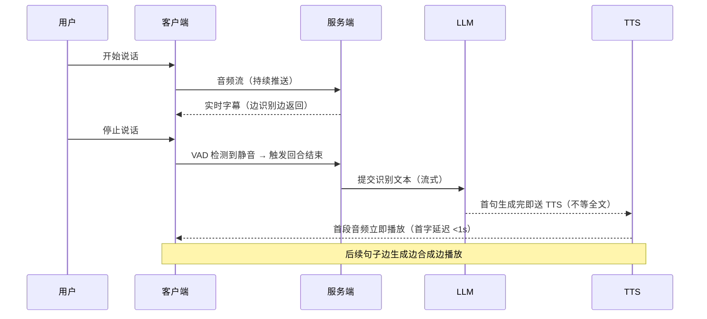
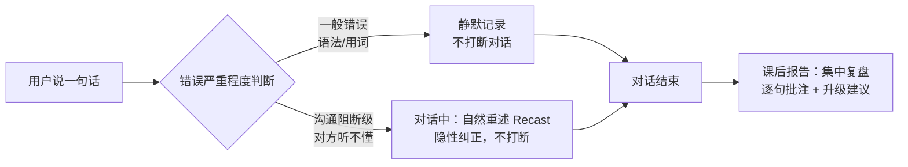

# AI 英语口语陪练工具 · 技术方案

> 黑客松题目一：开发一款英语口语练习工具，帮助用户在特定场景下进行真实对话训练。
> 核心需求：场景选择（面试 / 点餐 / 会议等）、实时语音对话、发音评测、语法/表达纠错、课后总结。
> 评审关注点：对话交互自然度、语音端到端流畅性与延迟、纠错精准度与时机、口语能力提升的可量化反馈。

---

## 一、产品定位与核心思考

### 1.1 一句话定位
> 一个"有耐心、懂教学、能记住你"的 AI 外教，在真实场景中陪你开口说英语，并给出可量化的成长反馈。

### 1.2 我对这个题目的关键判断

市面上的英语口语 App（如多邻国、流利说）已经很成熟，黑客松想做出彩，**不能比谁功能全，要比谁的"教学闭环"做得巧**。我认为这个题目的胜负手有三个：

1. **对话自然度（沉浸感）**
   - 用户要感觉"在和真人聊天"，而不是"在做填空题"。
   - 关键：低延迟（用户说完到 AI 开口 < 1.5s）、AI 会追问、会扮演角色（面试官就要严肃、服务员就要热情）。

2. **纠错的"时机"而非"频率"（教学法）**
   - 这是最容易被忽略、也最能体现深度的点。**实时打断纠错会破坏对话流畅性，让用户不敢开口。**
   - 我的策略：**对话中"不打断"，只做轻量标记；对话结束后"集中复盘"**。这符合二语习得的"流利优先、准确随后"原则（Krashen 输入假说 + Communicative Approach）。
   - 只有当用户犯了"沟通阻断级"错误（对方完全听不懂）时，AI 才以"自然重述（recast）"方式隐性纠正——这是真外教的做法。

3. **可量化的成长反馈（记忆点）**
   - 评委最容易被"数据可视化"打动。一份漂亮的**课后报告**（发音雷达图、语法错误 TOP3、地道表达升级建议、本次 vs 上次进步曲线）是 Demo 的高光时刻。

### 1.3 差异化亮点（区别于现有产品）

| 亮点 | 说明 |
|------|------|
| 场景化角色扮演 | AI 不只是对话，而是"入戏"扮演面试官/店员/同事，有人设和目标 |
| 不打断的纠错哲学 | 对话中保护流畅性，结束后集中复盘，更符合教学规律 |
| 隐性纠错（Recast） | 对严重错误用"自然重述"代替"直接指出"，体验更像真人 |
| 成长档案 | 跨会话记录，能看到能力曲线，形成"用下去"的动力 |

---

## 二、功能模块拆解

```
英语口语陪练
├── 场景中心（Scenario Hub）
│   ├── 预设场景：面试 / 点餐 / 会议 / 机场 / 看医生 / 闲聊
│   ├── 难度分级：初级 / 中级 / 高级（影响 AI 语速、用词、追问深度）
│   └── 角色设定：AI 人设、对话目标、成功标准
│
├── 实时对话引擎（Conversation Engine）★核心
│   ├── 流式语音识别（ASR，边说边出字）
│   ├── 对话大脑（LLM，带角色 prompt + 上下文记忆）
│   ├── 流式语音合成（TTS，边生成边播放）
│   └── 打断/插话处理（VAD 语音活动检测）
│
├── 发音评测（Pronunciation Assessment）
│   ├── 准确度 Accuracy（音素级）
│   ├── 流利度 Fluency（停顿/语速）
│   ├── 完整度 Completeness
│   └── 重音/语调 Prosody
│
├── 纠错引擎（Correction Engine）★核心
│   ├── 语法纠错（Grammar）
│   ├── 表达地道度（Native-like expression）
│   ├── 纠错时机控制（对话中 vs 课后）
│   └── 隐性重述（Recast）
│
└── 课后总结（Review & Report）★记忆点
    ├── 对话全文 + 逐句批注
    ├── 发音能力雷达图
    ├── 错误归类与高频错误 TOP3
    ├── 地道表达升级（你说的 → 更地道的说法）
    └── 成长曲线（历史对比）
```

---

## 三、整体技术架构



### 关键设计：端到端低延迟的"流式管线"

实现"自然对话"的核心是 **streaming（流式）+ 并行**，绝不能"等用户说完整句 → 等 ASR 全转完 → 等 LLM 全生成完 → 等 TTS 全合成完"这种串行阻塞。



> **延迟优化目标**：用户停止说话 → AI 开始发声 < 1.5 秒（首包延迟）。
> 手段：流式 ASR、LLM 流式输出按句切分、TTS 句级流式合成、客户端边收边播。

---

## 四、技术栈选型

> 选型原则：黑客松时间有限，**优先用成熟 API/SDK 兜底，把精力花在编排与体验上**，避免自研模型。

### 4.1 前端

| 类别 | 选型 | 理由 |
|------|------|------|
| 框架 | React 18 + TypeScript + Vite | 生态成熟、开发快 |
| UI 组件 | Tailwind CSS + shadcn/ui | 快速做出现代美观界面 |
| 状态管理 | Zustand | 轻量，适合管理对话流状态 |
| 音频采集 | Web Audio API + MediaRecorder | 浏览器原生，无需插件 |
| VAD | `@ricky0123/vad-web`（Silero VAD wasm） | 浏览器端检测说话开始/结束，体验关键 |
| 实时通信 | WebSocket（原生 / socket.io） | 双向流式音频与文本 |
| 图表 | ECharts / Recharts | 雷达图、成长曲线可视化 |

### 4.2 后端

| 类别 | 选型 | 理由 |
|------|------|------|
| 运行时 | Node.js (NestJS) 或 Python (FastAPI) | 都支持异步流式；团队熟悉哪个用哪个 |
| 实时层 | WebSocket / Server-Sent Events | 流式推送字幕和音频 |
| 任务编排 | 自研轻量 Pipeline（或 LangChain/LangGraph） | 串联 ASR→LLM→纠错→TTS |
| 数据库 | PostgreSQL | 用户档案、会话记录 |
| 缓存 | Redis | 对话上下文、会话状态 |
| 对象存储 | MinIO / 云 OSS | 存储录音用于发音评测回放 |

### 4.3 AI 能力层（核心，给出"国内可用 + 国际"两套备选）

| 能力 | 国际方案 | 国内方案 | 备注 |
|------|---------|---------|------|
| 流式 ASR | OpenAI Whisper / Deepgram / AssemblyAI | 阿里云、讯飞、火山 ASR | Deepgram 流式延迟低 |
| 对话 LLM | GPT-4o / Claude | 通义千问 / DeepSeek / 豆包 | GPT-4o 支持实时语音 |
| 流式 TTS | OpenAI TTS / ElevenLabs / Azure | 火山、讯飞、Azure 中文区 | ElevenLabs 音色最自然 |
| 发音评测 | **Azure Speech Pronunciation Assessment** | 讯飞语音评测、网易有道 | ⭐Azure 是行业标杆，音素级评分 |
| 语法纠错 | LLM / LanguageTool / GPT | LLM（千问/DeepSeek） | 用 LLM 做更灵活 |

> **强烈推荐发音评测用 Azure**：它直接返回音素级 Accuracy / Fluency / Completeness / Prosody 四维评分，省去自研，效果专业，是 Demo 报告的数据来源。

### 4.4 极简方案（如果想偷懒/赶时间）

直接用 **OpenAI Realtime API**（GPT-4o 语音版）：
- 一个 WebSocket 搞定 语音输入 → 理解 → 语音输出，端到端延迟极低、对话极自然。
- 缺点：发音评测、纠错仍需另接（Realtime 不给音素评分），且需要稳定的网络/代理。
- **建议组合**：对话用 Realtime API（保证自然度），发音评测用 Azure（保证专业数据），课后总结用 GPT-4o（文本分析）。这是性价比最高的"黑客松三件套"。

---

## 五、核心技术难点与解决方案

### 5.1 难点一：端到端流畅性与低延迟

**问题**：串行管线会累积延迟（ASR 1s + LLM 2s + TTS 1.5s = 4.5s，体验灾难）。

**方案**：
1. **全链路流式**：ASR 边说边转、LLM 流式输出、TTS 句级合成、客户端边收边播。
2. **句级切分并行**：LLM 输出第一句话立即送 TTS，不等整段生成完。
3. **VAD 端点检测**：客户端检测用户说完（静音 ~700ms）立即触发，不靠用户手动点按钮。
4. **预热与连接复用**：WebSocket 长连接，避免每轮握手开销。
5. **兜底**：首包来之前播放轻微"思考"音效/动效，掩盖等待感。

### 5.2 难点二：纠错的"精准度"与"时机"（最能体现深度）

**核心理念**：对话中重流利，对话后重准确。



**实现**：
- 每轮用户发言后，**异步**调用纠错 LLM（不阻塞主对话），打分并标记错误类型，存入会话上下文。
- 纠错 Prompt 设计返回结构化 JSON：
  ```json
  {
    "original": "I very like this job",
    "corrected": "I really like this job",
    "errorType": "adverb_misuse",
    "severity": "minor",
    "explanation": "用 'really' 而非 'very' 修饰动词",
    "betterExpression": "I'm really excited about this role"
  }
  ```
- 区分"语法错误"（必须改）与"表达升级"（可以更地道），后者是高级感的来源。

### 5.3 难点三：发音评测

**方案**：直接调用 Azure Pronunciation Assessment。
- 输入：用户音频 + 参考文本（用 ASR 识别结果作为参考）。
- 输出：总分 + 音素级评分 + 哪几个音读错了。
- 报告呈现：标红读得差的单词/音素，给出口型/舌位提示（可让 LLM 生成讲解）。

### 5.4 难点四：可量化的能力反馈

**多维度评分体系**：

| 维度 | 数据来源 | 呈现方式 |
|------|---------|---------|
| 发音准确度 | Azure 评测 | 雷达图一轴 |
| 流利度 | 语速/停顿统计 | 雷达图一轴 |
| 语法准确率 | 纠错引擎（错误数/句数） | 雷达图一轴 |
| 词汇丰富度 | LLM 分析（词汇多样性 TTR） | 雷达图一轴 |
| 任务完成度 | LLM 判断是否达成场景目标 | 雷达图一轴 |
| 进步曲线 | 跨会话历史对比 | 折线图 |

> 关键：把抽象的"口语能力"拆成 5 个可打分的维度，画成**雷达图**，再叠加**历史成长曲线**，这就是 Demo 的"哇时刻"。

---

## 六、数据模型（核心表）

```
users            用户：id, name, level, target_scenario
sessions         会话：id, user_id, scenario, started_at, ended_at, overall_score
turns            对话轮次：id, session_id, role(user/ai), text, audio_url, timestamp
pronunciations   发音评测：id, turn_id, accuracy, fluency, completeness, prosody, phoneme_detail(json)
corrections      纠错记录：id, turn_id, original, corrected, error_type, severity, explanation
reports          课后报告：id, session_id, radar_scores(json), top_errors(json), summary_text
```

---

## 七、MVP 范围与黑客松节奏建议

> 原则：**砍需求保体验**。场景做 1-2 个精品，把流畅度和报告做到极致，远胜过 6 个场景但每个都卡顿。

### 必做（P0，决定能否拿奖）
- [x] 1 个精品场景（建议"面试"，最有代入感）的实时语音对话
- [x] 端到端流式，首包延迟 < 1.5s
- [x] 对话中不打断、课后集中纠错
- [x] 一份漂亮的课后报告（雷达图 + 错误 TOP3 + 表达升级）

### 应做（P1，加分）
- [ ] 发音评测接入 Azure，报告里展示音素级评分
- [ ] 2-3 个场景 + 难度选择
- [ ] 隐性重述（Recast）

### 可选（P2，有余力再做）
- [ ] 成长曲线（需要多次会话数据，可造假数据演示）
- [ ] 角色语音音色定制（面试官 vs 服务员不同音色）
- [ ] 多人会议场景（多 AI 角色）

### 时间分配建议（以 36 小时计）
| 阶段 | 时间 | 内容 |
|------|------|------|
| 0-4h | 架构搭建 | WebSocket 通路、前后端骨架、API key 打通 |
| 4-12h | 对话引擎 | 流式 ASR→LLM→TTS 跑通，调延迟 |
| 12-20h | 纠错 + 评测 | 纠错引擎、Azure 发音评测接入 |
| 20-28h | 课后报告 | 雷达图、报告页面、数据可视化 |
| 28-32h | 打磨体验 | 角色 prompt 调优、UI 美化、动效 |
| 32-36h | 演示准备 | 录制 Demo、彩排、兜底预案 |

---

## 八、风险与兜底预案

| 风险 | 兜底 |
|------|------|
| 现场网络差，API 调用慢/失败 | 准备本地录屏 Demo；关键链路加超时重试 |
| LLM 输出不稳定 | 严格 Prompt + JSON Schema 约束 + 解析失败重试 |
| 实时延迟达不到预期 | 加"思考"动效掩盖；降级为短句快速响应 |
| 发音评测接口没调通 | 报告里发音维度用规则/LLM 估算兜底 |
| 时间不够 | 死守 P0，砍掉 P1/P2，保证一条完整链路能演示 |

---

## 九、演示策略（拿奖关键）

1. **讲故事**：开场抛痛点——"中国人学了十年英语，见到老外还是不敢开口，因为没有真实场景练习的机会。"
2. **现场互动**：邀请评委亲自上手，和 AI 面试官对话一轮（互动感拉满）。
3. **高光时刻**：对话结束，"唰"地弹出可视化课后报告（雷达图 + 进步曲线 + 表达升级），数据说话。
4. **强调差异化**：点明"不打断的纠错哲学"和"隐性重述"，体现你们的教学法思考深度，而非纯堆 API。
5. **留钩子**：展望成长档案、个性化学习路径，体现产品远景。

---

## 十、总结

这个题目的本质不是"技术炫技"，而是**用 AI 还原一个好外教的教学闭环**。

- 技术上：用成熟 API 快速搭流式管线，把延迟做低。
- 体验上：保护对话流畅性，用"不打断 + 课后复盘"的教学法做出差异化。
- 记忆点上：用一份数据化的成长报告打动评委。

**一句话：别比功能多，要比"像不像一个懂你的真外教 + 一份让你看得见进步的成绩单"。**
